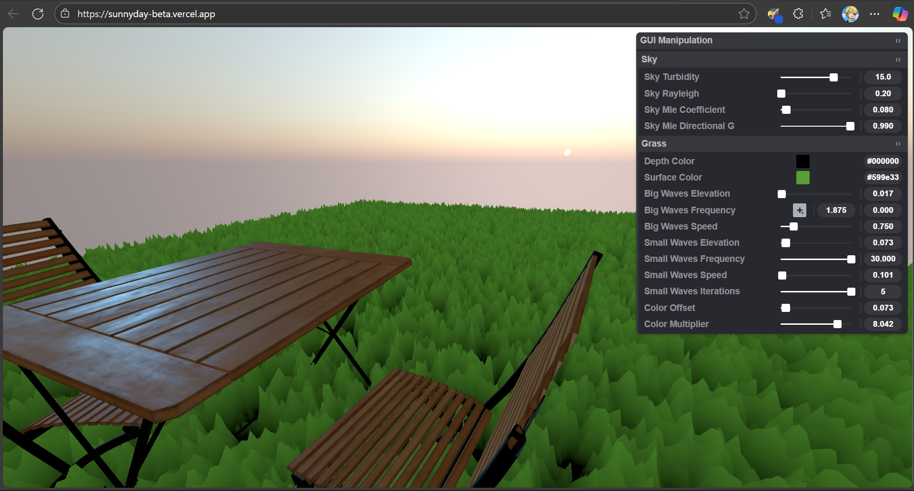

# ☀️ Sunny 3D Scene – Table, Chair & Grass with Shaders

This project is a beautifully crafted real-time 3D scene built using [Three.js](https://threejs.org/). It features a sunny day setting with a hand-modeled **table and chair**, **procedural grass shaders**, and a vibrant **summer sky**. Perfect for showcasing your WebGL, GLSL, and creative coding skills!

https://sunnyday-beta.vercel.app/

## ✨ Features

- 🪑 Custom 3D models: Table and chair
- 🌱 Realistic grass using vertex/fragment shaders
- 🌤️ Sunny sky with adjustable sun and light direction
- 🎮 Orbit controls for interactive camera movement
- ⚡ Optimized for performance and responsiveness

## 🖼 Preview

    


## 🛠️ Technologies Used

- [Three.js](https://threejs.org/)
- GLSL (Custom shaders for grass wave animation)
- OrbitControls
- Vite / Webpack (if used)


## 🚀 Getting Started

1. Clone the repository  
   ```bash
   git clone https://github.com/Druv-4182122/Sunny-Day.git
   cd sunny-scene

   npm install
   
   npm run dev
    ```
